# Vision-Transformer

 

Implementation of the ViT model in Pytorch from the paper ['An Image is Worth 16x16 Words: Transformers for Image Recognition at Scale'](https://openreview.net/forum?id=YicbFdNTTy) by Google Research.

## Model Architecture

## Paper Description

### Aim

- Explore Transformer-based architectures for Computer Vision Tasks.
- Transformers have been the de-facto for NLP tasks, and CNN/Resnet-like architectures have been the state of the art for Computer Vision.
- Till date, researchers have tried using attention for Vision, but used them in conjunction with CNN.
- This paper mainly discusses the strength and versatility of *vision* transformers, as it kind of approves that they can be used in recognition and can even beat the state-of-the-art CNN.

### Methodology

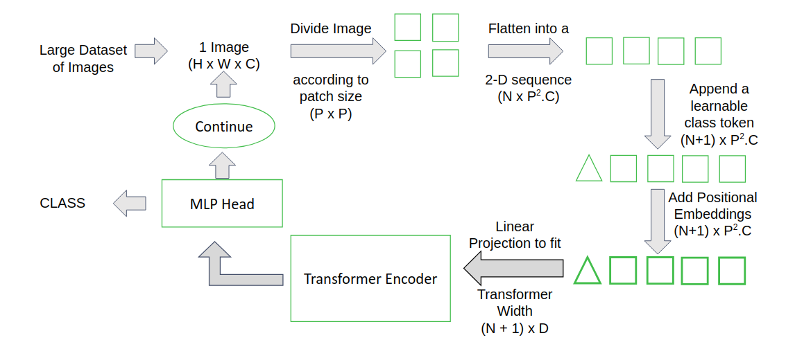

### Transformer Encoder

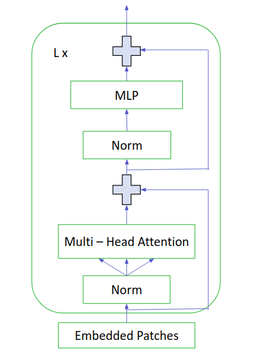

### Testing

- The authors have tested different variants of Vision Transformer having different patch size, number of layers, and embedding dimension, on datasets of different sizes – `ImageNet`, `JFT300M`, `CIFAR10/100` etc.
- The results of Vision Transformer have been compared with results of other architectures as well – `BiT (Resnet 152x4)`, and `EfficientNet`, on same conditions.
- The models have also been evaluated on `VTAB classification` suite consisting of `19` tasks divided into groups as Natural, Specialized and Structured Tasks.
- They have also performed a preliminary exploration on masked patch prediction for self-supervision.

## Why do we need attention mechanism?

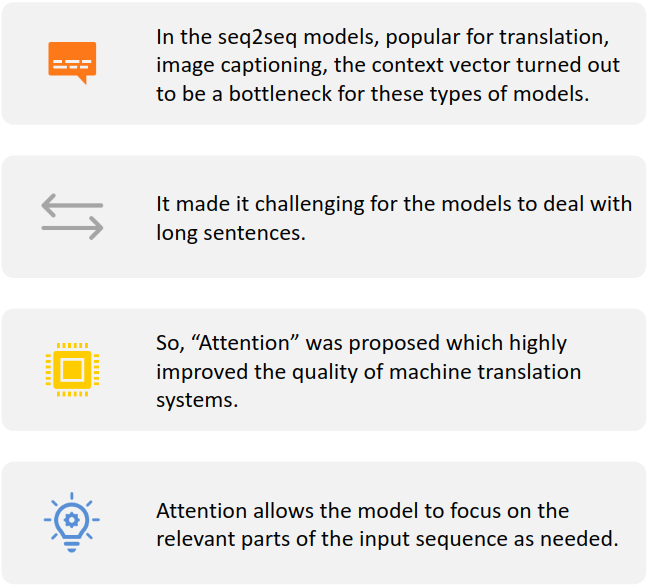

### Attention Mechanism

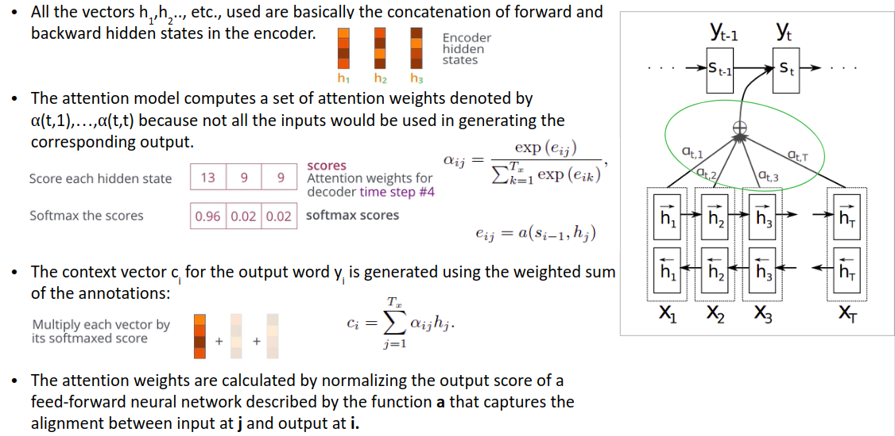

### Multi-Head Attention

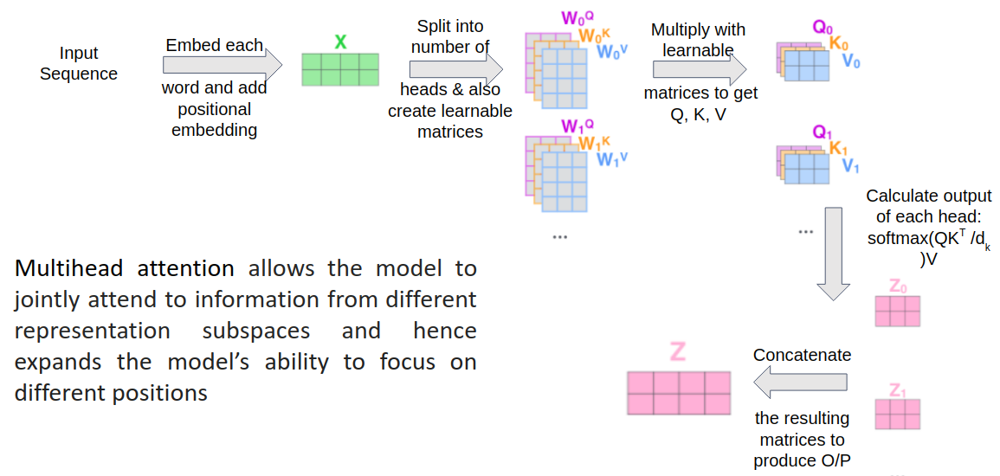

## Datasets

Due to non-availability of powerful compute on Google Colab, we chose to train and test on these 2 datasets – 
- [CIFAR 10](https://www.cs.toronto.edu/~kriz/cifar.html)
- [CIFAR 100](https://www.cs.toronto.edu/~kriz/cifar.html)

## Major Components Implemented

- **Vision Transformer** implemented *from scratch* which includes Multihead Attention, FeedForward, Transformer and Classification Head module ([VisionTransformer.ipynb](VisionTransformer.ipynb))
- **Hybrid Variant of Vision Transformer** with Pretrained ResNet features as input to the Transformer ([VisionTransformer.ipynb](VisionTransformer.ipynb))
- **Modular ResNet** implemented *from scratch* (ResNet34, ResNet50) ([VisionTransformer.ipynb](VisionTransformer.ipynb))
- **Pretrained Vision Transformer** using [external code](https://github.com/jeonsworld/ViT-pytorch) to verify results from the paper ([PretrainedVisionTransformer.ipynb](Pretrained_ViT_Final.ipynb))   
- **Attention Map Visualization** on input images ([PretrainedVisionTransformer.ipynb](Pretrained_ViT_Final.ipynb))
- Visualization of *Filter Embeddings* ([PretrainedVisionTransformer.ipynb](Pretrained_ViT_Final.ipynb))
- Visualization of *Position Embeddings* ([PretrainedVisionTransformer.ipynb](Pretrained_ViT_Final.ipynb))

## Results

### Attention Map Visualisation

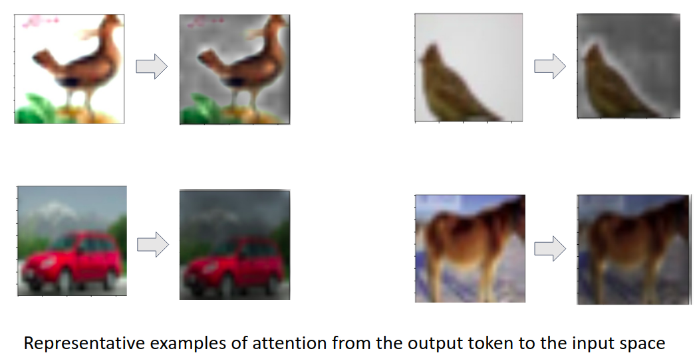

### Patch Embedding 

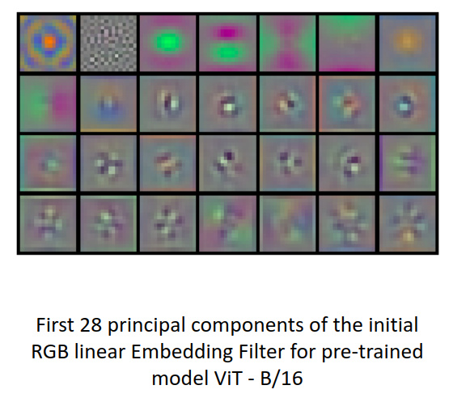

### Position Embedding

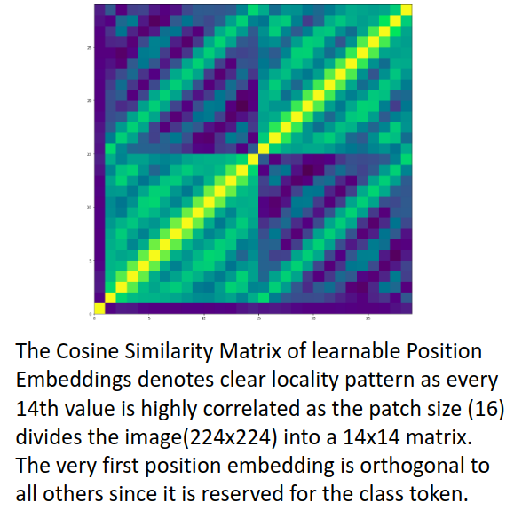

### Results for Different Model Variations 

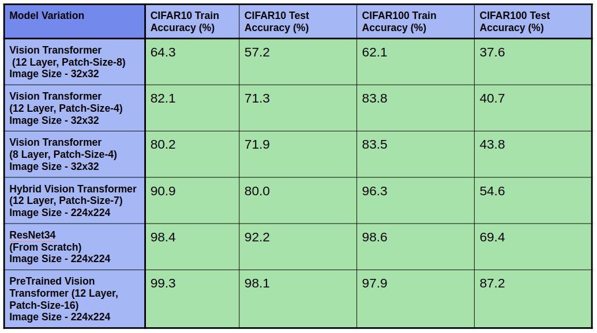

### Inference from Results

- Patch size in the Vision Transformer decides the length of the sequence. **Lower patch size leads to higher information exchange during the self attention mechanism. This is verified by the better results using lower patch-size 4 over 8 on a 32x32 image**
- Increasing the number of layers of the Vision Transformer should ideally lead to better results but the **results on the 8 Layer model are marginally better than the 12 Layer model which can be attributed to the small datasets used to train the models.** Models with higher complexity require more data to capture the image features
- **As noted in the paper, Hybrid Vision Transformer performs better on small datasets compared to ViT** as the initial ResNet features are able to capture the lower level features due to the locality property of Convolutions which normal ViT is not able to capture with the limited data available for training.
- ResNets trained from scratch are able to outperform both ViT and Hybrid-ViT trained from scratch due to its **inherent inductive bias** of locality and translation invariance. These **biases can not learned by the ViT on small datasets.**
- **PreTrained ViT performs much better than the other methods due to being trained on huge datasets** and thus having learned the better representations than even ResNet since it can access much further information right from the very beginning unlike CNN.

### Train vs Test Accuracy Graphs (CIFAR10)

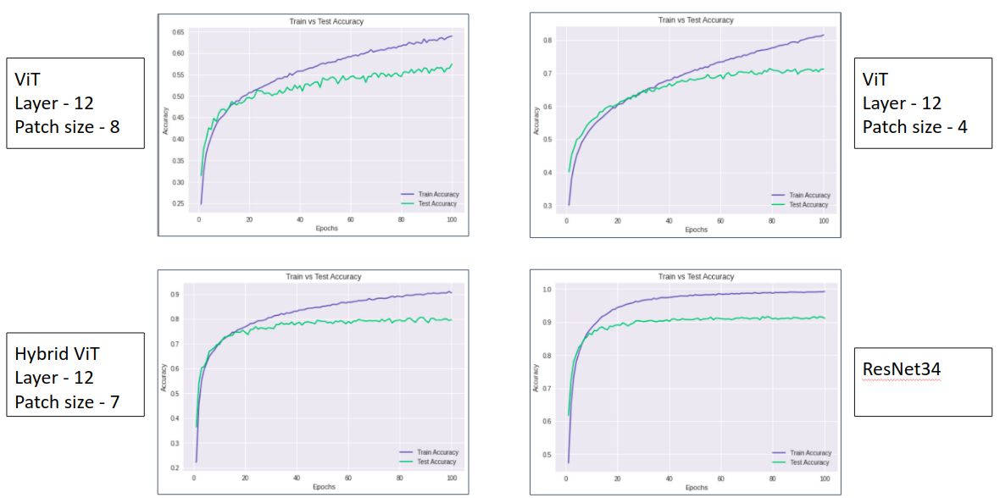

### Train vs Test Accuracy Graphs (CIFAR100)

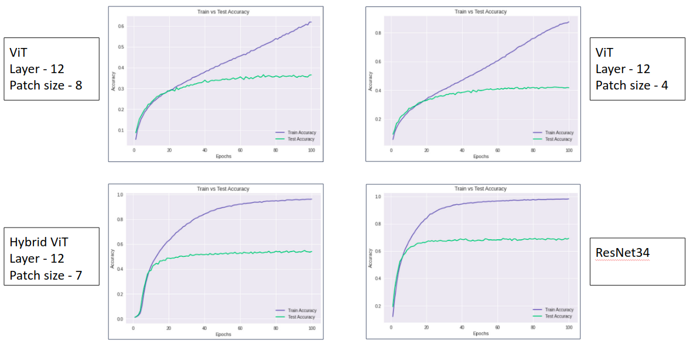

## Future Scope

- Due to non-availability of better computing resources, the model could not be trained on large datasets which is the first and the foremost requirement of this architecture to produce very high accuracies. Due to this limitation, we could not produce accuracies as mentioned in the paper in implementation from scratch. 
- Evaluating the model on VTAB classification suite.
- Different Attention mechanisms could be explored that take the 2D structure of images into account.

## Presentation

Presentation can be accessed [here](docs/Presentation.pptx).

## Group Members

| Name                | ID            |
| ------------------- | ------------- |
| Akshit Khanna       | 2017A7PS0023P |
| Vishal Mittal       | 2017A7PS0080P |
| Raghav Bansal       | 2017A3PS0196P |

## References

- [An Image is Worth 16x16 Words: Transformers for Image Recognition at Scale](docs/an_image_is_worth_16x16_words_transformers_for_image_recognition_at_scale.pdf) (Paper)
- Eunkwang Jeon, ViT-pytorch (2020), [GitHub repository](https://github.com/jeonsworld/ViT-pytorch)
